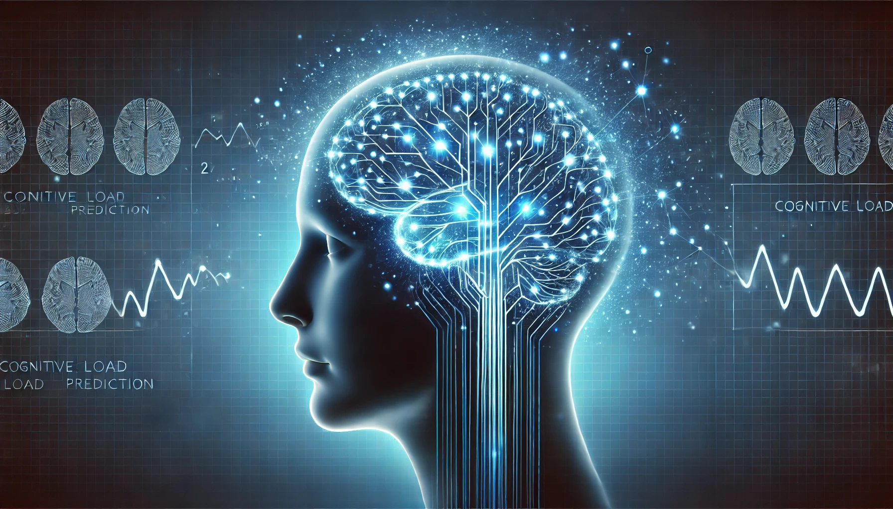

# Unlocking Minds

## Repository Link

[Link](https://github.com/HBendig-HSFL/unlocking-minds/)

## Description

Using (only) Eyetracking data (like Fixations, Saccades, Blinks, etc.) for the classificiation of cognitive workload¹  
Can be binary (low / high) or three-leveld (low / mid / high)

Challenges:

- Most research is using traditional classifiers
  - May because of the elaborate data collection with human participants
- Multimodal data is more accurate
  - People are different

¹ Cognitive workload: In cognitive psychology, cognitive load refers to the amount of working memory resources used.

### Task Type

- Deep Generative Modelling (cGAN and statistical approach)
- Binary and Multiclass Classification (with GNB and DNN)

### Results Summary

- **Best Model:** Gaussian Naive Bayes with synthetic data
  
- **Evaluation Metric:** Accuracy, Recall, Precision, F1-Score

- **Result:**

|            	| GNB Bin. 	| GNB Bin. Aug. 	| NN Bin. 	| NN Bin. Aug. 	|
|-----------	|----------	|---------------	|---------	|--------------	|
| Accuracy  	| 0.6842   	| 0.7256        	| 0.5789  	| 0.7041       	|
| Precision 	| 0.6739   	| 0.7299        	| 0.5556  	| 0.8198       	|
| Recall    	| 0.6842   	| 0.7255        	| 1       	| 0.7606       	|
| F1        	| 0.6771   	| 0.7276        	| 0.7143  	| 0.7891       	|

## Documentation

1. **[Literature Review](0_LiteratureReview/README.md)**
2. **[Dataset Characteristics](1_DatasetCharacteristics/exploratory_data_analysis.ipynb)**
3. **[Baseline Model](2_BaselineModel/baseline_model.ipynb)**
4. **[Model Definition and Evaluation](3_Model/model_definition_evaluation)**
5. **[Presentation](4_Presentation/README.md)**

## Cover Image

